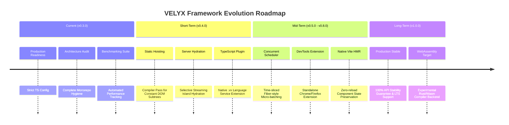

# VELYX Framework Technical Roadmap (v0.3.0 → v1.0.0)

This roadmap outlines the official technical milestones, compiler architectural evolutions, runtime optimizations, and ecosystem goals for **VELYX**, developed by **Florynx Labs**.

---

## 🎯 Release Vision & Philosophy

VELYX is built on three unbreakable tenets:
1. **Compiler-First Excellence:** Shift reactivity complexity from runtime Virtual DOM diffing to compile-time Intermediate Representation (IR) optimization.
2. **Zero-Overhead Reactivity:** Granular signal graphs that update only the exact DOM text nodes and attributes affected by state changes.
3. **10-Year Forward Stability:** Minimal core API surfaces, robust plugin extension hooks, and strict TypeScript types.

---

## 📍 Release Roadmap

---

## 📋 Detailed Milestone breakdown

### 🟢 Milestone 1: v0.3.0 — Architecture Stabilization & Production Readiness (Current)
* [x] **Monorepo Stabilization:** Clean pnpm workspace configuration and strict package boundaries.
* [x] **TypeScript Hardening:** `noUncheckedIndexedAccess`, `exactOptionalPropertyTypes`, and `verbatimModuleSyntax` enforced across all 10 packages.
* [x] **Core Test Suite:** 100% test coverage across signals, scheduler, IR pipeline, and DOM renderer.
* [x] **Community Documentation:** Complete `CONTRIBUTING.md`, `SECURITY.md`, and architectural documentation in `docs/`.

---

### 🟡 Milestone 2: v0.4.0 — Compiler Optimization Passes & Selective Hydration
* [ ] **Static Subtree Hoisting:** Identify DOM subtrees containing zero signal references and hoist their creation outside render functions.
* [ ] **Constant Folding:** Evaluate static arithmetic expressions during the IR pass.
* [ ] **Partial Hydration (Islands):** Ship client JS only for components containing interactive `vx-on:*` handlers.
* [ ] **Language Server Protocol (LSP):** Prototype a basic LSP plugin for `.vx` syntax highlighting, auto-complete, and diagnostics in VS Code.

---

### 🟠 Milestone 3: v0.5.0 - v0.8.0 — Advanced Runtime & Ecosystem Tooling
* [ ] **Concurrent Time-Sliced Scheduler:** Interruptible low-priority rendering for massive DOM lists using `requestIdleCallback` integration.
* [ ] **Chrome/Firefox DevTools Extension:** Visual signal graph visualizer, component inspector tree, and time-travel state debugger.
* [ ] **State-Preserving HMR:** Hot Module Replacement adapter preserving signal values during component source edits.
* [ ] **Official UI Component Library:** First-party accessible primitives (`@velyx/ui`).

---

### 🔴 Milestone 4: v1.0.0 — Production Release & Long-Term Support (LTS)
* [ ] **API Surface Lock:** Freeze `@velyx/core`, `@velyx/compiler`, and `@velyx/runtime` public signatures under semantic versioning.
* [ ] **Cross-Framework Benchmarks:** JS Framework Benchmark suite inclusion (competing directly with SolidJS, Svelte, and React).
* [ ] **Wasm Compiler Backend (Experimental):** Porting the IR optimization passes to Rust/Wasm for ultra-fast multi-threaded Vite builds.

---

*For suggestions or feedback on this roadmap, please submit an RFC in `docs/rfcs/` or open a discussion on GitHub.*
