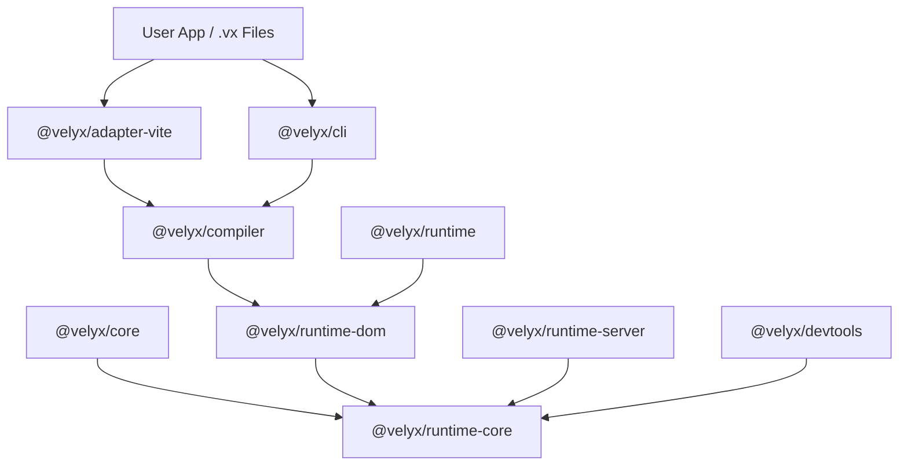
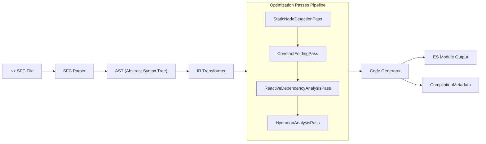
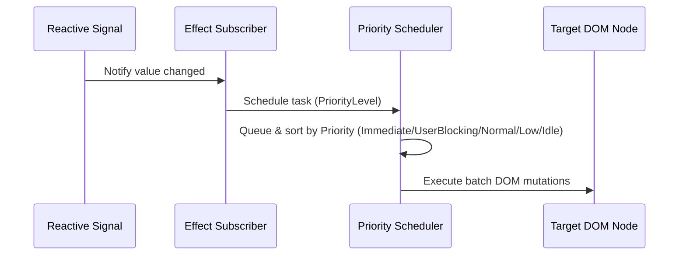
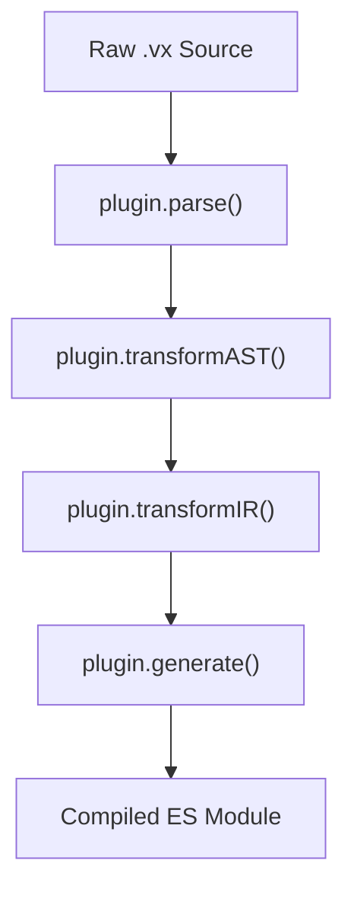

# 🏛️ VELYX System Architecture Documentation (v0.2.0 Core Team Edition)

**Florynx Labs Engineering**

---

## 1. Monorepo Package Topology

---

## 2. Compiler Pipeline & Intermediate Representation (IR)

---

## 3. Priority Scheduler & Reactive Signal Graph

---

## 4. Plugin Pipeline Lifecycle

---

## 5. Performance Targets & Quality Criteria

- **Runtime Footprint**: <4KB gzip
- **Cold Start**: <5ms
- **Virtual DOM Overhead**: 0% (Zero VDOM)
- **TypeScript**: Strict Mode (Zero `any`)
- **Backwards Compatibility**: 100% (Core & Runtime Facades)
